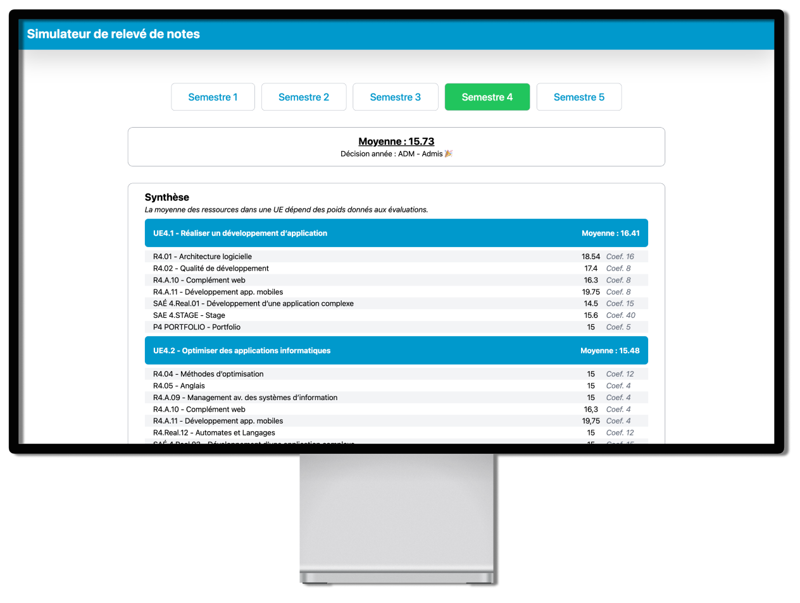

# 🌐 Results Simulator - [simulator.callhatem.fr](https://simulator.callhatem.fr)

<p align="center">
  
</p>

The Results Simulator helps students in the BUT Informatique program simulate their academic results based on various input factors. It allows for an accurate prediction of grades across different semesters, helping students to better understand their academic progress. 🌟

## 🛠️ Technologies Used

This project uses:
- [SvelteKit](https://kit.svelte.dev) 
- [TailwindCSS](https://tailwindcss.com) 

These technologies provide a modern and efficient development environment for the simulator.

## 📂 Installation and Setup

To run this project locally, follow these steps:

1. Clone the repository:
   ```bash
   git https://github.com/ouaischatem/results-simulator
   cd your-repo
   ```
2. Install dependencies: :
   ```bash
   npm install
   ```
3. Start the local server:
   ```bash
    npm run dev
   ```
4. Open your browser and navigate to:
   ```bash
    http://localhost:5173/
   ```
   
## 📧 Contact

Have questions or want to collaborate? Feel free to reach out:

- **[Email](mailto:contact@callhatem.fr)** : contact@callhatem.fr
- **[Portfolio](https://callhatem.fr)** : callhatem.fr
- **[LinkedIn](https://www.linkedin.com/in/hatem-obeidine)** : Hatem Obeidine